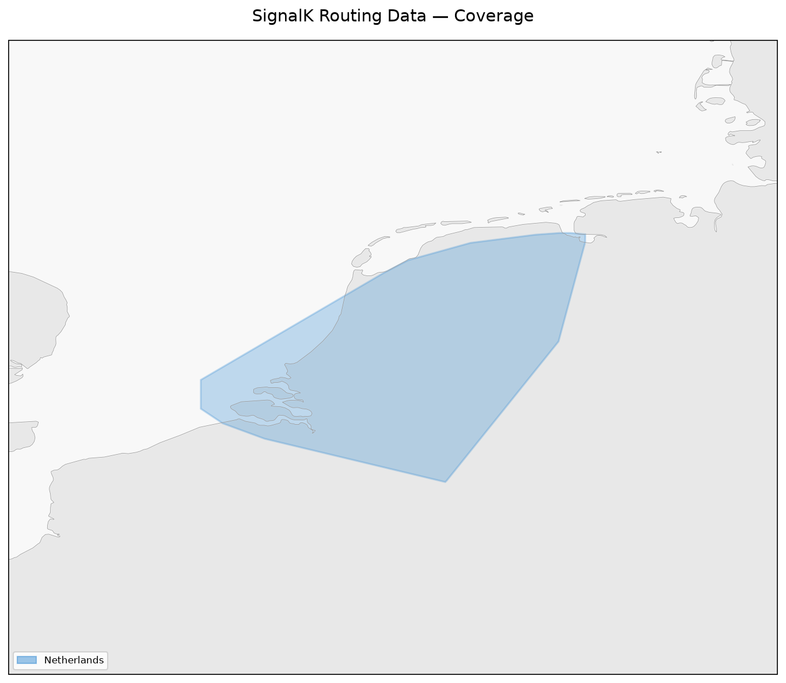

# SignalK Routing Data

Pre-compiled nautical routing graphs for the [SignalK Autoroute route planner](https://github.com/marcelrv/signalk-autoroute). These `.sqlite` databases contain all the nodes, edges, and POIs needed for offline, vessel-aware route planning.

Databases are stored as `.sqlite.gz` (gzip-compressed) to reduce download size. The plugin's download dialog handles decompression automatically.

## Coverage

## Available Regions

Full machine-readable catalog: [index.json](index.json)

| File | Country | Name | Nodes | Edges | POIs | Updated | Tags |
|------|---------|------|-------|-------|------|---------|------|

## Quick Start

1. Install the [SignalK Autoroute route planner](https://github.com/marcelrv/signalk-autoroute)
2. Set `routingDataDir` in the plugin config to a directory on your server
3. Download the `.sqlite.gz` file(s) for your region(s) from [the regions folder](regions/) or use the plugin's built-in "Manage Routing Data" dialog
4. The plugin automatically decompresses `.sqlite.gz` files on download — just use the dialog
5. Restart the plugin

Multiple `.sqlite` files can coexist in the same directory — the plugin merges them at startup.

## Contributing

We welcome new regions! See [CONTRIBUTING.md](CONTRIBUTING.md) for the database format and submission process.

## License

Each database file may have its own licensing terms as documented in the `metadata.url` and `metadata.contributor` fields. Check individual file metadata for attribution and license information.

---

*Maintained by the SignalK Autoroute community.*
