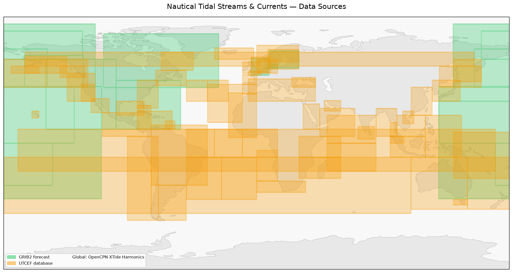
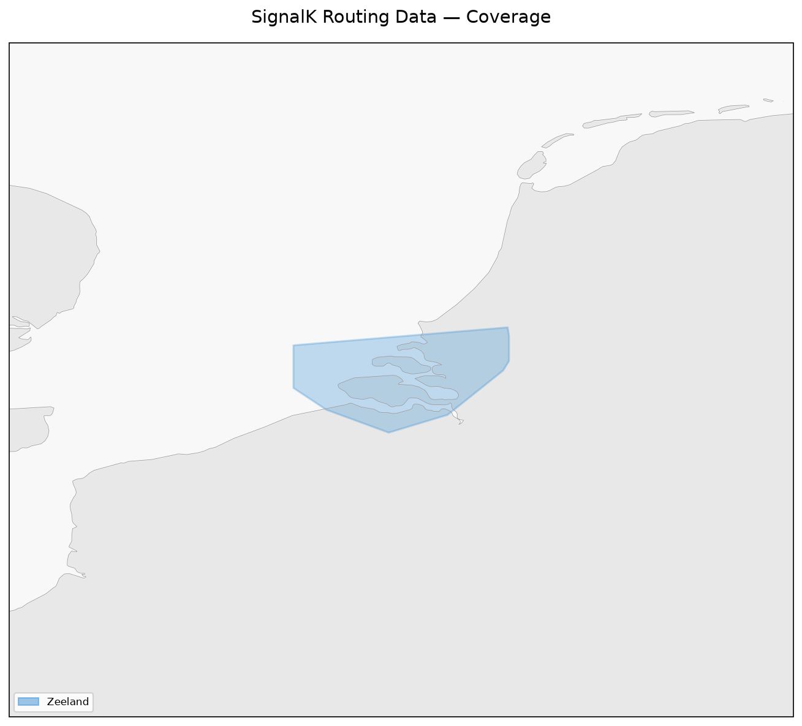

# Nautical Routing & Tidal Streams Data

Pre-compiled nautical routing graphs for the [SignalK Autoroute nautical route planner](https://github.com/marcelrv/signalk-autoroute) and tidal/current data sources for the [SignalK Tidal Currents](https://github.com/marcelrv/signalk-tidal-currents) plugin.

**Licensing:** Code and tooling are [GPLv3](LICENSE). Original/compiled data catalogs and databases are [CC-BY-NC-4.0](LICENSE-DATA.md). Third-party data sources (NOAA RTOFS, FES2014, OpenCPN) follow their own upstream terms — see the [License & Attribution](#license--attribution) section below.

Routing databases are stored as `.sqlite.gz` (gzip-compressed) to reduce download size. The plugin's download dialog handles decompression automatically.

## Coverage

### Tidal Streams & Currents

### Routing Databases

## Data Sources

Tidal/current data comes from three kinds of upstream sources, each suited to a different need:

| `type` | Source | What it provides |
|--------|--------|-------------------|
| `harmonic` | OpenCPN / XTide | ASCII harmonic constituents for named stations — small, static files, no refresh needed |
| `grib2` | NOAA RTOFS | Regional gridded ocean current *forecasts* (24/48/72h), refreshed daily; covers 11 named NOAA regions (US coasts, Alaska/Arctic, tropical Pacific/Hawaii/Guam/Samoa) |
| `utcef` | FES2014 (via AVISO+) | Dense-grid harmonic tidal current predictions derived from the FES2014 global tide model — static, no refresh needed |

See [specs/tide-current-catalog.md](specs/tide-current-catalog.md) for the full catalog schema and [specs/utcef-specification.md](specs/utcef-specification.md) for the UTCEF file format.

## Machine-Readable Catalogs

| Catalog | File | Spec |
|---------|------|------|
| Routing graph databases | [`routing-index.json`](routing-index.json) | [specs/routing-database-catalog.md](specs/routing-database-catalog.md) |
| Tide/current data sources | [`tide-current-index.json`](tide-current-index.json) | [specs/tide-current-catalog.md](specs/tide-current-catalog.md) |
| Unified Tidal and Current Exchange Format (UTCEF) | — | [specs/utcef-specification.md](specs/utcef-specification.md) |

## Quick Start

### Autoroute (Routing)
1. Install the [SignalK Autoroute nautical route planner](https://github.com/marcelrv/signalk-autoroute)
2. Set `routingDataDir` in the plugin config to a directory on your server
3. Download the `.sqlite.gz` file(s) for your region(s) from [the regions folder](regions/) or use the plugin's built-in "Manage Routing Data" dialog
4. The plugin automatically decompresses `.sqlite.gz` files on download — just use the dialog
5. Restart the plugin

Multiple `.sqlite` files can coexist in the same directory — the plugin merges them at startup.

### Tidal Currents
1. Install the [SignalK Tidal Currents](https://github.com/marcelrv/signalk-tidal-currents) plugin
2. The plugin reads `tide-current-index.json` to list available data sources
3. Download the sources for your region via the plugin UI

## Contributing

We welcome new regions and data sources! See:
- [CONTRIBUTING.md](CONTRIBUTING.md) for routing database format and submission
- [specs/tide-current-catalog.md](specs/tide-current-catalog.md) for adding new tide/current data sources

## License & Attribution

### Routing databases

Each database file may have its own licensing terms as documented in its `metadata.url` and `metadata.contributor` fields (see [routing-index.json](routing-index.json)). Check individual file metadata for attribution and license information.

### Tidal/current data

- **NOAA RTOFS** (`grib2` sources): public domain, U.S. Government work.
- **OpenCPN / XTide harmonics** (`harmonic` sources): see the [OpenCPN project](https://github.com/OpenCPN/OpenCPN/tree/master/data/tcdata) for licensing of the underlying station data.
- **UTCEF / FES2014-derived datasets** (`utcef` sources, e.g. files under [`regions/europe`](regions/europe)): derived from the FES2014 global tide model, produced by Noveltis, LEGOS and CLS and distributed by AVISO+, with support from CNES. Redistribution follows the [AVISO+ License Agreement](https://www.aviso.altimetry.fr/fileadmin/documents/data/License_Aviso.pdf) (scientific and non-commercial use).

  **These derived datasets are not endorsed by, affiliated with, or supported by AVISO, CNES, or any FES2014 copyright holder.** If you use this data, please cite: *"FES2014 was produced by Noveltis, Legos and CLS and distributed by Aviso+, with support from Cnes (https://www.aviso.altimetry.fr/)"*. To access the raw global FES2014 dataset directly, visit [AVISO+](https://www.aviso.altimetry.fr/en/data/products/auxiliary-products/global-tide-fes.html).

---

*Maintained by the SignalK Autoroute and Tidal Currents community.*
